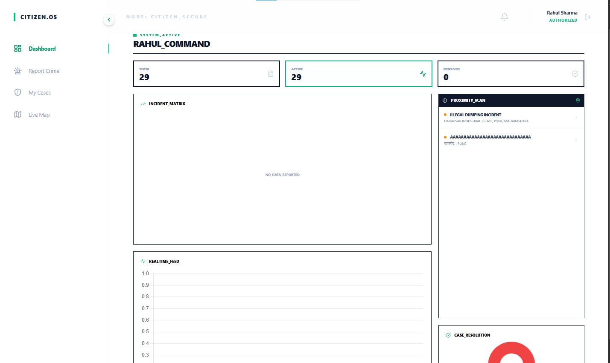
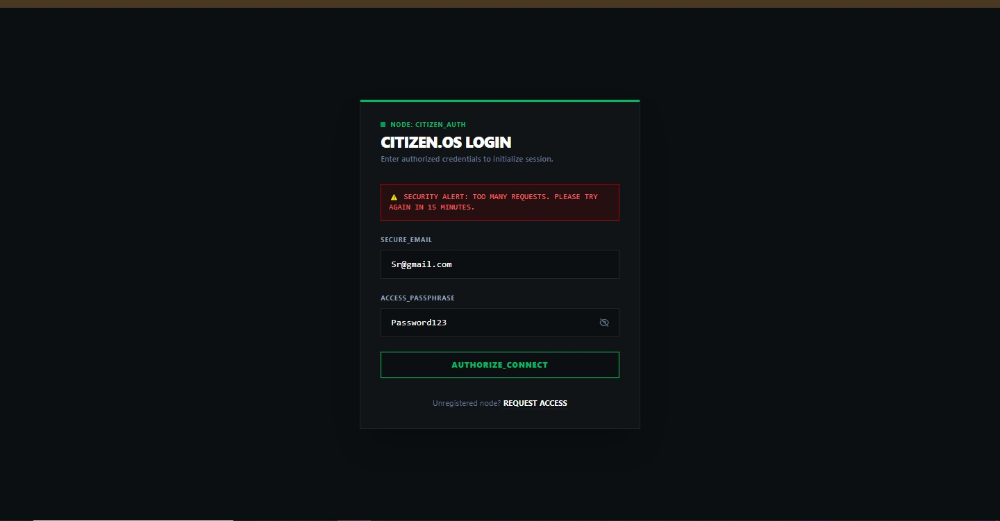
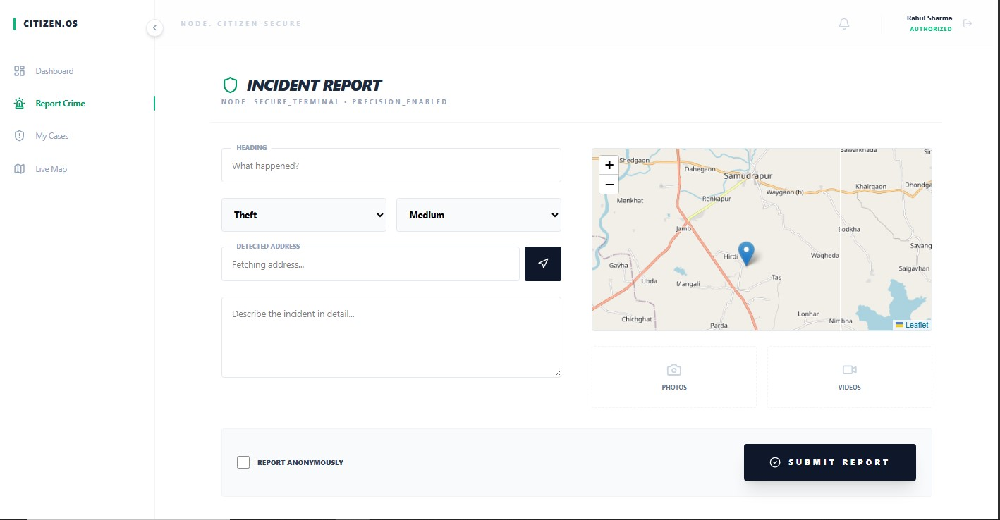
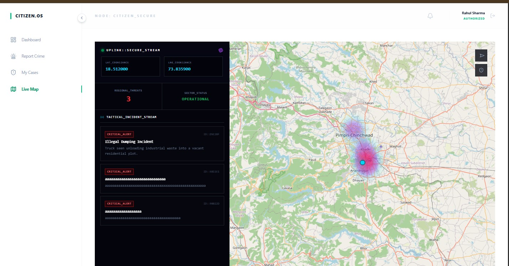
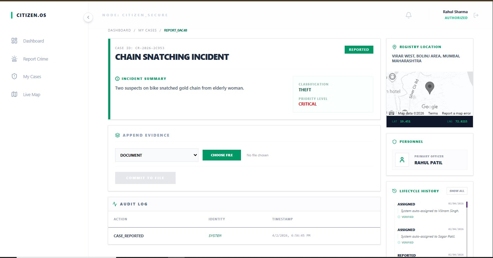
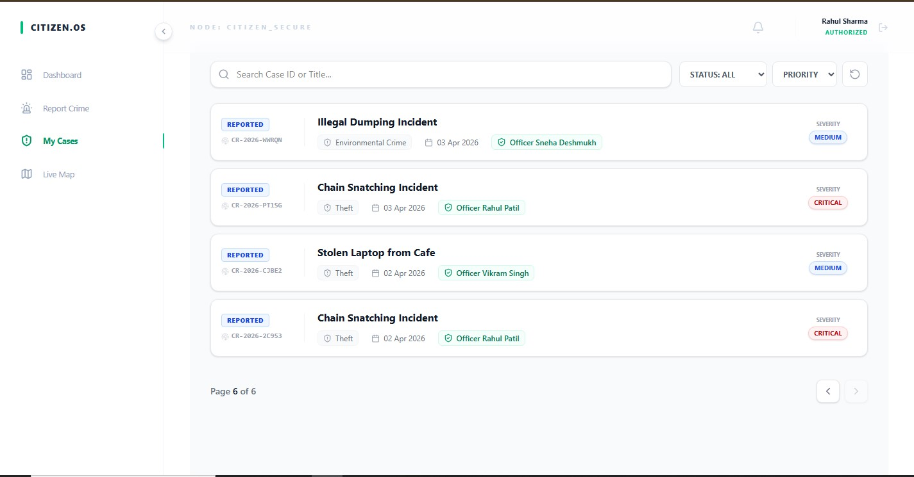
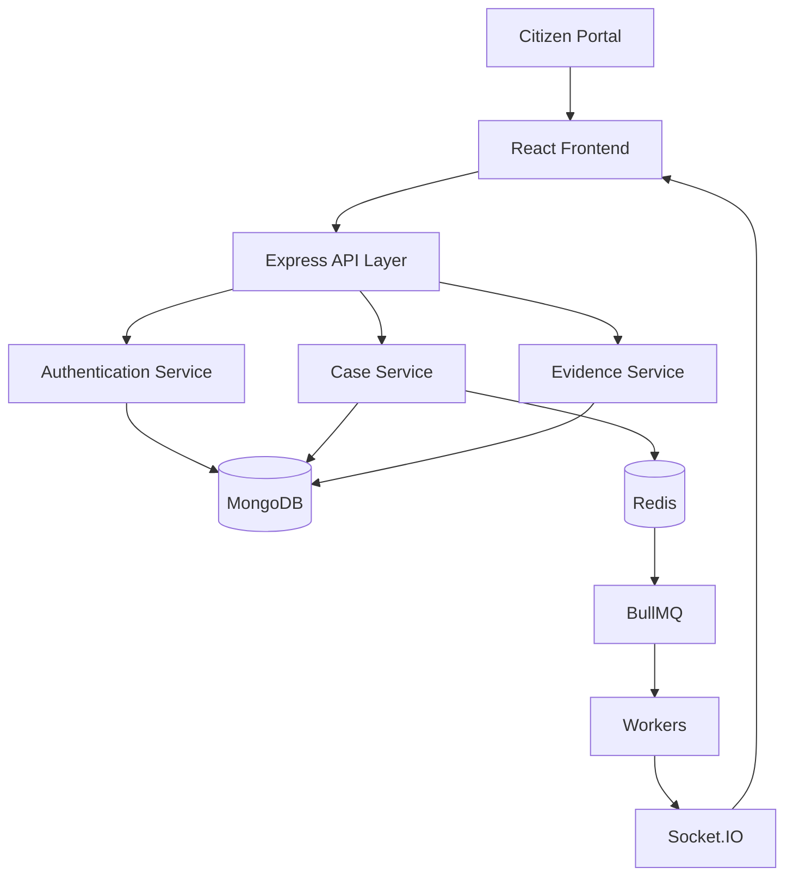
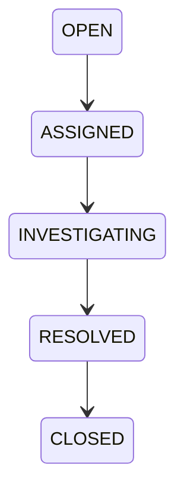
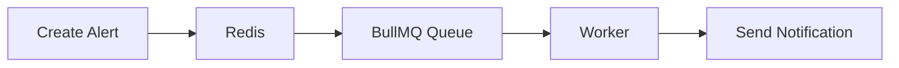

# 🚔 Crime Response & Tracking System (CRTS)


---

# 📖 Executive Summary

Crime Response & Tracking System (CRTS) is a real-time emergency incident management platform designed to digitize the complete crime-response lifecycle.

The platform enables:

- Crime Reporting
- Officer Assignment
- Case Investigation
- Evidence Management
- Real-Time Tracking
- Alert Broadcasting
- Audit Logging
- Geospatial Analytics

The system is built using a scalable service-oriented architecture powered by:

```txt
React + Node.js + Express + MongoDB + Redis + BullMQ + Socket.IO
```

---

# 🌐 Live Demo

### Frontend

[https://your-frontend-url.vercel.app](https://smart-crime-intelligence-and-case-management-platfor-cnfa7zaq2.vercel.app/dashboard)

### Backend API

[https://your-backend-url.onrender.com](https://smart-crime-intelligence-and-case.onrender.com)

---

# 📸 Application Screenshots

## 🏠 Dashboard



Real-time command center displaying active incidents, crime metrics, alerts, and operational insights.

---

## 🔐 Login Page



Secure authentication interface supporting JWT-based login and role-based access control.

---

## 🚨 Report Crime



Multi-step crime reporting interface allowing citizens to submit incident details and evidence.

---

## 🌍 Crime Hotspot Analytics



Interactive geospatial crime analysis dashboard highlighting crime-prone zones and hotspots.

---

## 📋 Crime Details Page



Detailed investigation dashboard containing case information, evidence, officer assignment, and workflow status.

---

## 📑 Created Crime List



Centralized incident repository with advanced filtering, searching, and status tracking.

---

# 🎯 Business Problem

Traditional incident management systems often face:

- Manual officer assignment
- Delayed communication
- Lack of transparency
- Poor evidence tracking
- No real-time updates
- Limited analytics

These limitations increase response time and reduce operational efficiency.

CRTS solves these problems through:

✅ Real-Time Communication

✅ Workflow Automation

✅ GIS-Based Location Tracking

✅ Intelligent Officer Assignment

✅ Audit Logging

---

# 🏗️ High Level Architecture



---

# ⚙️ System Design

## Backend Architecture

```txt
Routes
  │
  ▼

Controllers
  │
  ▼

Services
  │
  ▼

Models
  │
  ▼

MongoDB
```

### Benefits

- Clean Separation of Concerns
- Easy Testing
- Better Maintainability
- Horizontal Scalability

---

# 🛠️ Technology Stack

| Layer | Technology |
|---------|------------|
| Frontend | React |
| State Management | Redux Toolkit |
| Styling | Tailwind CSS |
| Backend | Node.js |
| Framework | Express.js |
| Database | MongoDB |
| Queue System | BullMQ |
| Cache Layer | Redis |
| Realtime | Socket.IO |
| Authentication | JWT |
| Validation | Joi |
| File Upload | Multer |

---

# 🔐 Authentication & Authorization

## Authentication Flow

```txt
Login
  │
  ▼

Validate Credentials
  │
  ▼

Generate JWT
  │
  ▼

Generate Refresh Token
  │
  ▼

Return Tokens
```

### Security Features

- JWT Access Tokens
- Refresh Tokens
- Password Hashing
- Bcrypt
- Secure Cookies
- Token Rotation

---

# 👮 Role Based Access Control

| Role | Permissions |
|---------|------------|
| Admin | Full System Access |
| Officer | Manage Assigned Cases |
| Dispatch | Officer Allocation |
| Citizen | Report Crimes |

---

# 📂 Case Lifecycle Engine



Workflow middleware prevents invalid transitions.

```txt
OPEN -> ASSIGNED      ✅ Allowed
OPEN -> CLOSED        ❌ Blocked
```

---

# 🌍 Geospatial Intelligence

### Features

- Nearby Incident Detection
- Radius Search
- Crime Heatmaps
- Distance Calculations
- Officer Routing

### Technologies

```txt
GeoJSON
Haversine Formula
MongoDB Geospatial Queries
```

---

# ⚡ Real-Time Communication

Implemented using:

```txt
Socket.IO
```

### Real-Time Events

```txt
CASE_CREATED
CASE_UPDATED
OFFICER_ASSIGNED
ALERT_CREATED
LOCATION_UPDATED
```

Benefits:

- Instant Updates
- Reduced API Polling
- Better User Experience

---

# 🔄 Queue Based Processing

Heavy operations are processed asynchronously.

### Queue Flow



### Processed Jobs

- Alert Delivery
- Officer Matching
- Analytics Generation
- Scheduled Tasks

---

# 📊 Database Collections

## User

```js
{
  name,
  email,
  password,
  role,
  department
}
```

## Case

```js
{
  title,
  description,
  category,
  location,
  status,
  assignedOfficer
}
```

## Evidence

```js
{
  caseId,
  fileUrl,
  type,
  uploadedBy
}
```

## AuditLog

```js
{
  action,
  actor,
  timestamp,
  metadata
}
```

---

# 🚀 Scalability Strategy

```txt
Load Balancer
      │

 ┌────┼────┐

Node1 Node2 Node3

      │

Redis Cluster

      │

MongoDB Replica Set
```

---

# 🧪 Engineering Challenges Solved

### Real-Time Synchronization

**Solution:** Socket.IO Event Architecture

### Heavy Processing

**Solution:** BullMQ + Redis Workers

### Unauthorized Access

**Solution:** RBAC + JWT + Permission Middleware

### Location-Based Assignment

**Solution:** GeoJSON + Haversine Calculations

---

# 📈 Skills Demonstrated

- REST API Design
- Authentication
- Authorization
- RBAC
- MongoDB Schema Design
- Redis
- BullMQ
- Socket.IO
- Geospatial Computing
- Queue Processing
- Service Layer Architecture
- Error Handling
- Scalable System Design
- Real-Time Systems

---

# 🔮 Future Enhancements

### Phase 2

- AI Crime Classification
- Predictive Analytics
- Push Notifications
- Mobile Application

### Phase 3

- Kafka
- Kubernetes
- Microservices
- Event Sourcing

---

# 👨‍💻 Author

## Sagar

Full Stack Developer

### Tech Stack

```txt
JavaScript | React | Node.js | Express.js | MongoDB | Redis | Socket.IO
```

### Connect With Me

- GitHub: https://github.com/yourusername
- LinkedIn: https://linkedin.com/in/yourprofile

---

# ⭐ If you found this project useful, please give it a star.
